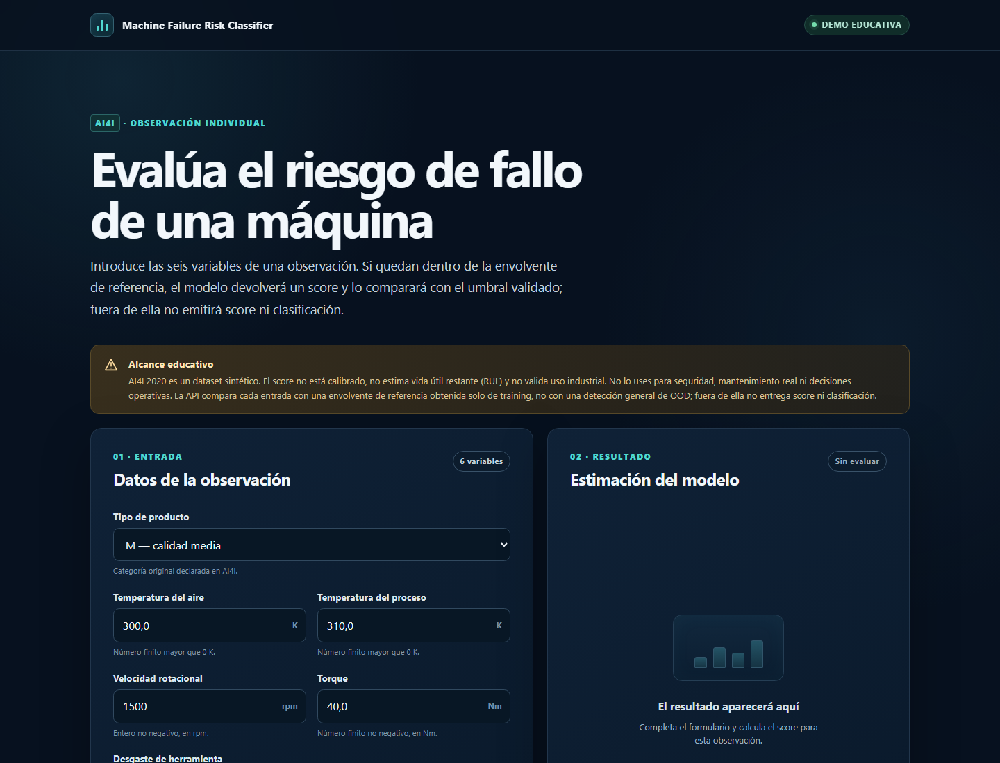
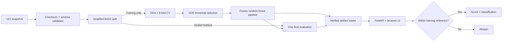

# Machine Failure Risk Classifier

[](https://github.com/xSkyLiN3/predictive-maintenance-ml/actions/workflows/ci.yml)
[](https://www.python.org/)
[](LICENSE)

An end-to-end, leakage-aware machine-learning system that classifies machine-failure risk for a
single observation. It turns the synthetic UCI AI4I 2020 dataset into a reproducible scikit-learn
pipeline, a strict FastAPI service and a responsive browser demo.

**[Try the educational demo](https://ml.nightstrike.cloud)** ·
**[Read the model card](docs/MODEL_CARD.md)** ·
**[Inspect the evaluation report](reports/modeling/b15bab7b54bc2e1f/M3_REPORT.md)**

> [!IMPORTANT]
> AI4I 2020 is synthetic. This project is not validated for real machinery, safety decisions or
> production maintenance. Its score was not assessed as a calibrated failure probability.



## What this project demonstrates

- a checksum-pinned data acquisition and validation contract;
- an explicit six-feature allowlist that excludes identifiers and failure-mode leakage;
- a sealed 20% holdout, with model selection and threshold tuning performed on training only;
- comparison against Dummy and logistic-regression baselines using five-fold cross-validation;
- reproducible reports, artifact manifests, hashes and a single-use holdout receipt;
- strict API schemas, fail-closed model loading and abstention outside the training reference;
- automated tests on Windows and Linux plus a minimal, non-root runtime container.

## Results

The selected random forest achieved the best mean cross-validation Average Precision (AP).

| Model | Mean CV AP |
|---|---:|
| Dummy baseline | `0.033875` |
| Logistic regression | `0.441433` |
| **Random forest** | **`0.643812`** |

The frozen model and threshold were then evaluated once on the 2,000-row holdout:

| Holdout metric | Result |
|---|---:|
| Average Precision | `0.649538` |
| ROC-AUC | `0.965458` |
| Precision | `0.588235` (Wilson 95%: `0.482`–`0.687`) |
| Recall | `0.735294` (Wilson 95%: `0.620`–`0.826`) |
| F1 | `0.653595` |

At that threshold the classifier detected 50 of 68 failures, missed 18, and raised 35 false
positives. Precision and recall are therefore estimates with meaningful sampling uncertainty; the
[model card](docs/MODEL_CARD.md) reports Wilson 95% intervals and the complete limitations.

## Architecture



The inference process does not read raw, training or holdout data. It validates the selected run,
pipeline hash, manifests, final receipt, global ledger, runtime versions, classes and feature order
before serving a prediction.

## Run it locally

### With Docker

```bash
docker build -t machine-failure-risk-classifier:1.0.0 .
docker run --rm -p 8000:8000 \
  --read-only --tmpfs /tmp --cap-drop=ALL \
  machine-failure-risk-classifier:1.0.0
```

Open <http://127.0.0.1:8000>. The image packages the exact evaluated pipeline, verifies its
SHA-256 and linked receipts before loading it, and contains no source data or train/holdout
partitions.

### From source

Python 3.12 is required. On Windows PowerShell:

```powershell
py -3.12 -m venv .venv
.\.venv\Scripts\python.exe -m pip install --upgrade pip
.\.venv\Scripts\python.exe -m pip install -c requirements\constraints-win-py312.txt -e ".[dev]"
.\.venv\Scripts\machine-failure-app.exe
```

Open <http://127.0.0.1:8000> after the server starts. The repository-owned Joblib file is loaded
only after its hash, run identity, dependency contract, selection receipts and final evaluation
ledger reconcile. The API never accepts uploaded model files.

To reproduce the training workflow separately, run `download`, `split` and `train` with the same
CLI. This does not repeat the final holdout evaluation. Joblib and Matplotlib bytes are
platform-dependent, so the public runtime deliberately ships the exact artifact that was
evaluated instead of silently substituting a Linux reserialization.

## API

The service exposes `GET /health`, `GET /model-info` and `POST /predict`.

```bash
curl -X POST http://127.0.0.1:8000/predict \
  -H "Content-Type: application/json" \
  -d '{
    "type": "L",
    "air_temperature_k": 300.0,
    "process_temperature_k": 310.0,
    "rotational_speed_rpm": 1500,
    "torque_nm": 40.0,
    "tool_wear_min": 100
  }'
```

The JSON contract rejects extra fields, duplicate keys, non-finite values, numeric strings and
oversized bodies. Inputs outside the training-derived marginal envelope receive HTTP 200 with an
explicit abstention and no model score. This is a narrow educational guardrail, not complete OOD
detection or a physical operating limit.

## Quality checks

```bash
python -m pip check
python -m ruff check .
python -m ruff format --check .
python -m pytest
python -m build
```

CI runs the relevant checks on Python 3.12 under Windows and Linux. The detailed methodology,
threat boundaries and reproducibility evidence remain reviewable rather than hidden behind the UI.

## Repository map

```text
src/predictive_maintenance/   data contract, modeling, inference and API
tests/                        unit, adversarial and integration tests
reports/                      curated EDA and model-evaluation evidence
docs/                         model card, attribution and decision record
data/                         versioned manifest; local CSV files are ignored
artifacts/                    exact evaluated pipeline plus its SHA-256 manifest
```

## Documentation

- [Model card](docs/MODEL_CARD.md)
- [Data and evaluation contract](docs/DATA_EVALUATION.md)
- [Data attribution and transformations](docs/DATA_ATTRIBUTION.md)
- [Decision record](docs/DECISIONS.md)
- [Portfolio review](docs/PORTFOLIO_REVIEW.md)
- [Changelog](CHANGELOG.md)

The implementation documentation is written in Spanish; the public overview and API use English
to keep the project accessible to a wider technical audience.

## Data and licensing

The project uses the [AI4I 2020 Predictive Maintenance Dataset](https://doi.org/10.24432/C5HS5C)
from the UCI Machine Learning Repository. The dataset is licensed under CC BY 4.0 and is not
redistributed in this repository. Its source, fixed hashes and derived transformations are recorded
in [DATA_ATTRIBUTION.md](docs/DATA_ATTRIBUTION.md).

Project code and documentation are released under the [MIT License](LICENSE).

## Author

Cristóbal Vergara — [GitHub](https://github.com/xSkyLiN3) ·
[LinkedIn](https://www.linkedin.com/in/cristobal-vergarav/)
