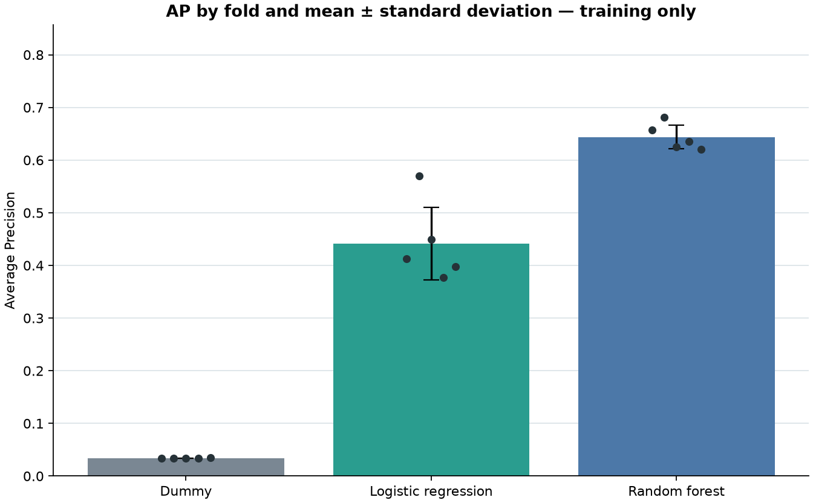
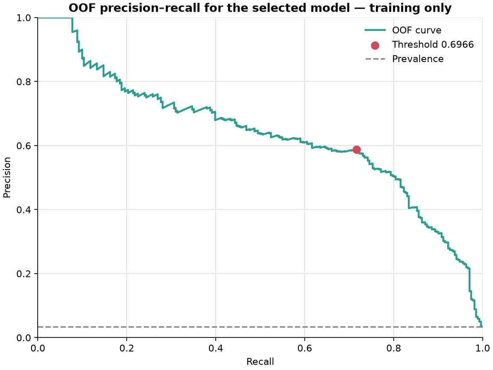
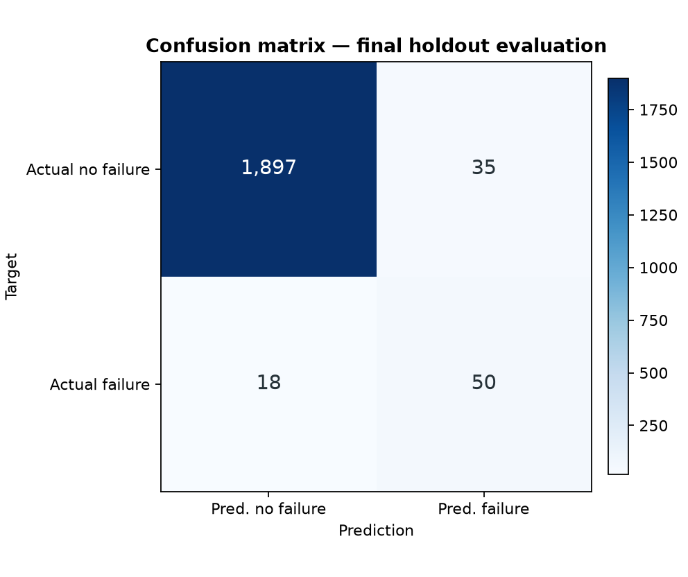

# Model evaluation report

> Run `b15bab7b54bc2e1f`. AI4I 2020 is synthetic. This result has not been validated for
> real-world industrial use, and the `predict_proba` scores were not evaluated as calibrated
> probabilities.

This is the canonical public English report for the frozen M3 result. It is derived from the
versioned receipts and the original
[`M3_REPORT.md`](../reports/modeling/b15bab7b54bc2e1f/M3_REPORT.md). That original run report is
archived evidence and remains immutable; this document does not replace, rewrite, or regenerate the
sealed evaluation.

The English figures below are presentation copies. The two selection figures were reproduced from
the training-only workflow, and the confusion matrix was rendered from the frozen final receipt.
The original hashed figures remain unchanged in the archived run directory.

## Evaluation protocol

- Source snapshot: `10,000` rows; SHA-256
  `dc6630cd9b1f0f853922fad78a1b6436570d3f1ec863f1dd5c4340ac56bc8a8e`.
- Training partition: `8,000` rows; SHA-256
  `3b114192f249951632f4c700c07b5edf4306fcff89ac90abe556f15687cf803a`.
- Holdout partition: `2,000` rows; SHA-256
  `50a1c9c07a57afbc6f34dd112852b61a44f81b6a83341241dd1bc7079f3ac4b7`.
- Split: `sklearn.model_selection.train_test_split`, stratified by `Machine failure`, with
  `holdout_fraction = 0.2` and random seed `42`.
- Model selection: mean `average_precision` over
  `StratifiedKFold(n_splits=5, shuffle=True, random_state=42)` on training only.
- Secondary metric: `roc_auc`; standard deviations use `ddof=0`.
- The holdout was not accessed during selection. It was read once for the final evaluation after
  the model and threshold were frozen.

The fold plan SHA-256 is
`2c24c5165e54481a6eb35ac08f579c78601ea191eee8a0d0a76537b034eddf48`, and the frozen M3
configuration SHA-256 is
`d880c8048fcb3c09395e38702fd9ca04b1d6e3e0b53fd882e7dd728bdb1b9065`.

## Selection on training only

| Candidate | Mean CV AP | AP std (`ddof=0`) | Mean CV ROC-AUC |
|---|---:|---:|---:|
| Dummy prior | `0.033875` | `0.0002500000000000002` | `0.5` |
| Logistic regression | `0.44143285508642044` | `0.06850845339545959` | `0.8992749262131948` |
| Random forest | `0.6438124425485383` | `0.02247288575462437` | `0.9699351406866447` |

The selected model is **`random_forest`**. Its mean AP improvement over the Dummy prior is
`0.6099374425485383`. The baseline gate passed because the selected mean AP was strictly greater
than the Dummy mean AP.

Per-fold Average Precision values:

| Fold | Dummy prior | Logistic regression | Random forest |
|---:|---:|---:|---:|
| 1 | `0.03375` | `0.41266348050038226` | `0.6572867305606113` |
| 2 | `0.03375` | `0.5701583004235514` | `0.6809245290316667` |
| 3 | `0.03375` | `0.4491937766383906` | `0.6253935606752442` |
| 4 | `0.03375` | `0.37739063115155913` | `0.6351334436973535` |
| 5 | `0.034375` | `0.39775808671821883` | `0.6203239487778157` |

## Threshold selection on out-of-fold training predictions

After model selection, one out-of-fold `predict_proba[:, 1]` score was generated for each training
row. The threshold strategy was `maximize_f1_on_out_of_fold_training_predictions`, using the
inclusive rule `score >= threshold`. The frozen threshold is `0.6965799216184142`.

| OOF selection metric | Value |
|---|---:|
| Pooled Average Precision, diagnostic | `0.6332800463156792` |
| Pooled ROC-AUC, diagnostic | `0.968384753067352` |
| Precision | `0.5878787878787879` |
| Recall | `0.7158671586715867` |
| F1 | `0.6455906821963394` |
| Positive predictions | `330` |
| True negatives | `7593` |
| False positives | `136` |
| False negatives | `77` |
| True positives | `194` |
| Matrix `[[TN, FP], [FN, TP]]` | `[[7593, 136], [77, 194]]` |

These values were used for threshold selection and are not final holdout results. Model selection
used mean AP across the five folds, not pooled OOF AP.

## Single final holdout evaluation

The final evaluation receipt records `application_reads_for_evaluation = 1` and
`final_holdout_evaluation_complete`. The same frozen model and threshold produced:

| Holdout metric | Value |
|---|---:|
| Average Precision | `0.6495379423468456` |
| ROC-AUC | `0.9654579222993546` |
| Precision at threshold | `0.5882352941176471` |
| Precision 95% Wilson CI | `0.4820101461448797`–`0.6868299449467584` |
| Recall at threshold | `0.7352941176470589` |
| Recall 95% Wilson CI | `0.619922660101109`–`0.825502593301211` |
| F1 at threshold | `0.6535947712418301` |
| Accuracy | `0.9735` |
| Positive prevalence | `0.034` |
| Majority-class accuracy | `0.966` |
| Positive predictions | `85` |
| True negatives | `1897` |
| False positives | `35` |
| False negatives | `18` |
| True positives | `50` |
| Matrix `[[TN, FP], [FN, TP]]` | `[[1897, 35], [18, 50]]` |

The confidence intervals were calculated from the frozen confusion-matrix counts; computing them
did not require another holdout access.

The result covers `2,000` synthetic observations. The model, features, and threshold were not
modified after this result was observed. Later compatible executions reuse the versioned receipt;
they do not reopen the holdout.

## Artifact and receipt identity

| Evidence | SHA-256 |
|---|---|
| Evaluated pipeline | `8f383492fff0a1199a7f62289651a29da39f4c6a149762aa9b75c099efc1568a` |
| Run manifest | `01c3c72a75df64922470ee163166fbb2437fad0b6c279ca54f0b5687ccb02a2a` |
| Cross-validation results | `ce9f62b79834c0da8d6a44311ae3714c18922820fc33f61a8ca9b3ab9f9e12f2` |
| Threshold selection | `9790eedc834f5624029a24c2e64a544392c171995bde51d33f89cf7cbe70d412` |
| Final evaluation receipt | `f3c947fe38fca0053c3f14e75c01681e5cef1dbcbc09e57fddb15409fd1e26c8` |
| Archived original CV figure | `66910cc58d584d022d24f30a11b6d5cee416b8f1555ddad63cadbe4a17230bf4` |
| Archived original OOF figure | `f6dff3af775046a40fad32fc9330340b0dc6ec6abc3f0803def3c70cea327f4e` |
| Archived original final confusion figure | `324a1b06b5ea2926fc0c79c7e562b10091f2c5cd35c94a43f131081c7db4dfd5` |
| English presentation CV figure | `4edc40eb04d5bb772932d833de48ca1033c97e205657a7970abe2e2b3447ac4f` |
| English presentation OOF figure | `788fefed557e41b18b73dedec0b8e96332f1bd5bef345794e5ba8a47153a4eaa` |
| English presentation final confusion figure | `39fd295aa7bf34f8925b70d2fcfbf819633a217742ee04e705afc4c954f69bbe` |
| Original M3 report | `24068a9147848cd8f9beed6d8b508297ee6f72e9e0a6ee6d2fadf10d0e275bff` |

Primary archived receipts:

- [run manifest](../reports/modeling/b15bab7b54bc2e1f/run_manifest.json);
- [cross-validation results](../reports/modeling/b15bab7b54bc2e1f/cv_results.json);
- [threshold selection](../reports/modeling/b15bab7b54bc2e1f/threshold_selection.json);
- [final evaluation receipt](../reports/modeling/b15bab7b54bc2e1f/final_evaluation.json);
- [holdout-access ledger](../reports/holdout_access/50a1c9c07a57afbc6f34dd112852b61a44f81b6a83341241dd1bc7079f3ac4b7.json).

The evaluated pipeline is the exact artifact recorded by these receipts. Its identity must be
verified before loading it; the archived evidence must not be edited to reconcile a different
artifact.

## Limits

- The random split estimates IID generalization within the synthetic generator, not temporal,
  cross-machine, or industrial generalization.
- `class_weight` improves treatment of the minority class, but the scores are not calibrated and
  must not be interpreted as industrial failure frequencies.
- No additional algorithms, hyperparameters, or features were tested after observing the result.
- The dataset is synthetic, and this evaluation does not establish safety, usefulness, or
  production readiness on real machinery.
