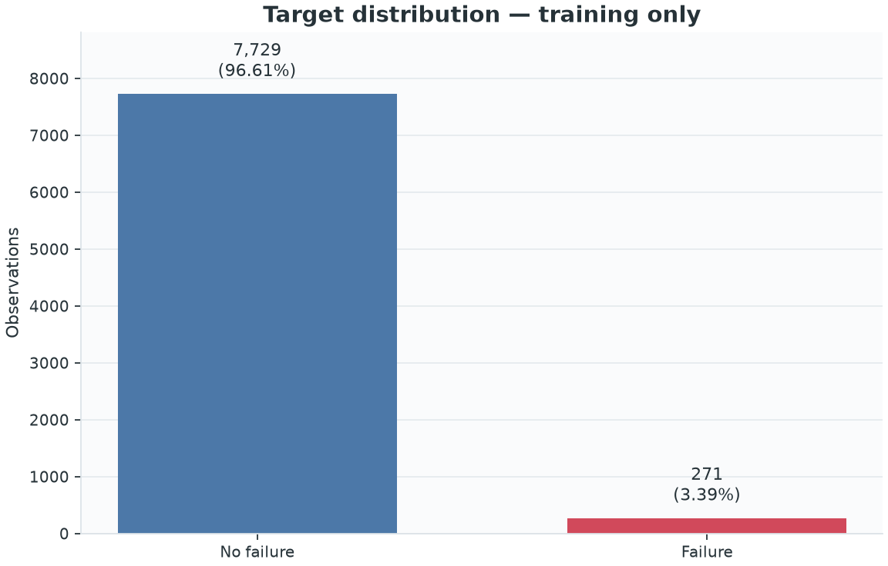
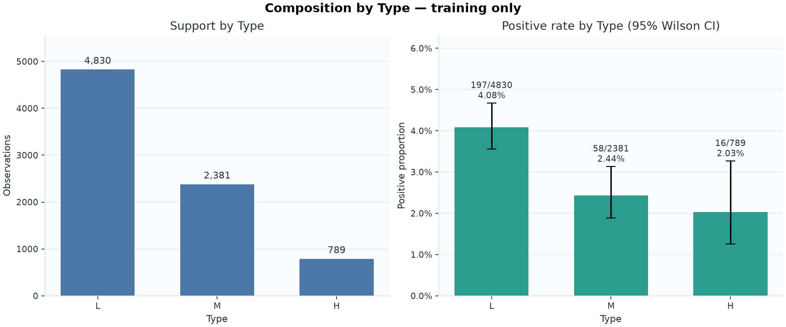
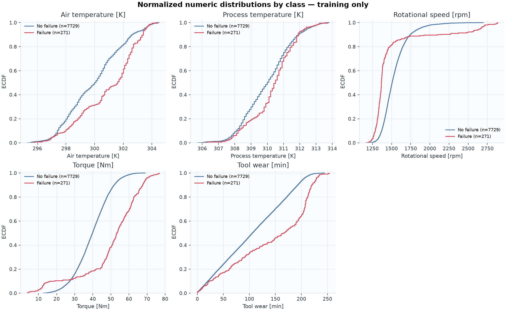
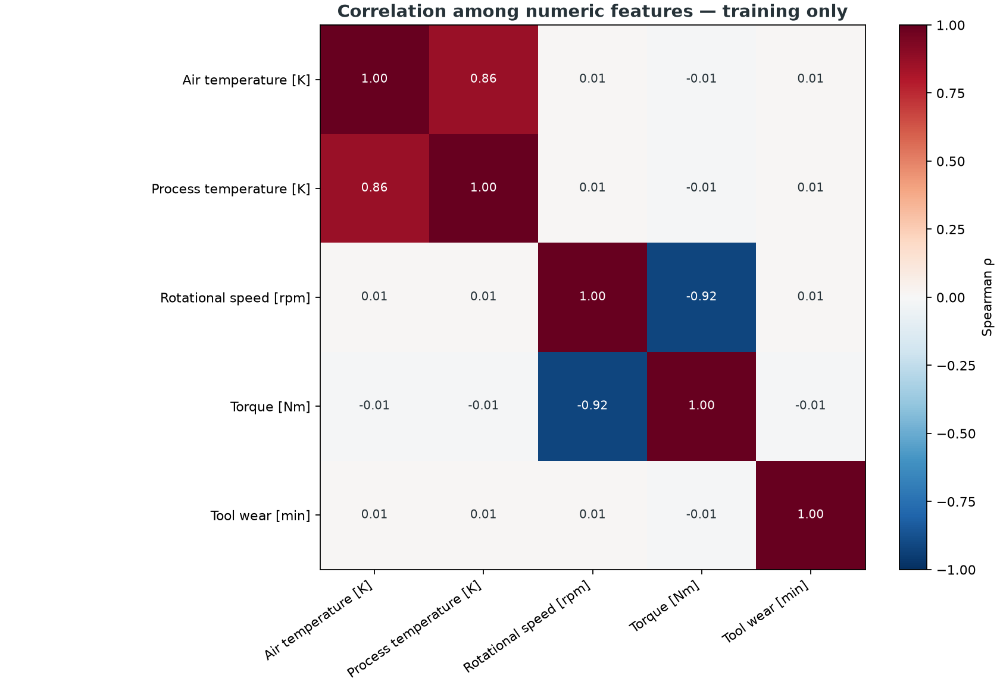
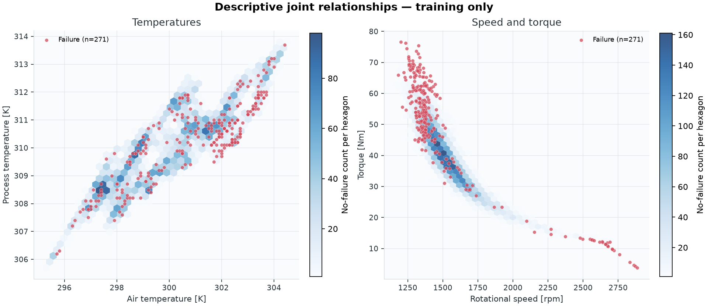
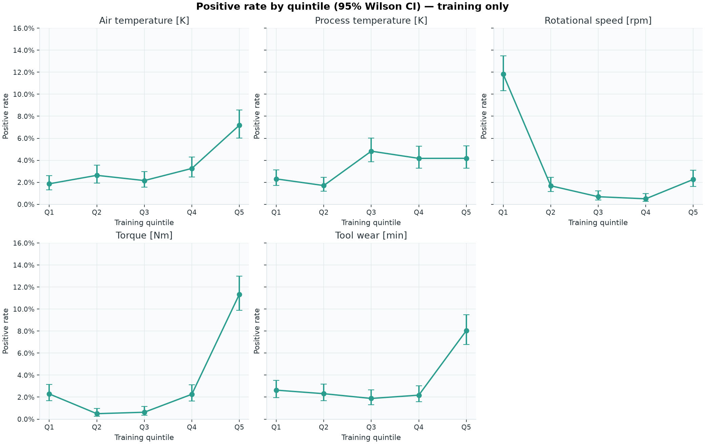

# Training EDA and frozen protocol

> Scope: this report uses exclusively the **training** partition after separating the holdout.
> AI4I 2020 is synthetic; the observed associations do not validate industrial use.

## Protocol frozen before modeling

- Source fixed by SHA-256: `dc6630cd9b1f0f853922fad78a1b6436570d3f1ec863f1dd5c4340ac56bc8a8e`.
- Split: 80% training / 20% holdout, stratified,
  with the predefined arbitrary random seed `42` and original snapshot order preserved
  within each partition. The seed was neither optimized nor compared with alternatives.
- Training rows analyzed: 8,000. The holdout is neither loaded nor profiled.
- M3 cross-validation: `StratifiedKFold(n_splits=5, shuffle=True,
  random_state=42)`, shared by every candidate.
- Baseline: `DummyClassifier(strategy="prior")`.
- Selection: highest mean AP across the 5 folds (`average_precision`); ROC-AUC
  (`roc_auc`) is secondary. Pooled OOF AP is diagnostic only and does not replace the
  CV mean. A tie within `1e-12` between logistic regression and random forest favors
  logistic regression for simplicity. If no candidate beats the dummy in mean AP, the holdout
  remains sealed.
- Threshold: `maximize_f1_on_out_of_fold_training_predictions` on `predict_proba[:, 1]`. F1 is maximized using one OOF
  prediction per training row and the `score >= threshold` rule; ties within
  `1e-12` are resolved by the smallest absolute difference between precision and
  recall, then by the lower threshold. The value is frozen before the one-time holdout evaluation.
- All preprocessing is fitted within each fold through a `Pipeline`.

M1 necessarily checked global file counts and ranges to validate the data contract. Since this
partition was created in M2, no holdout-specific statistics, examples, or results have been used
to make decisions.

## Training data quality and class balance

- Rows: 8,000.
- Positive: 271; negative: 7,729.
- Positive prevalence: **3.39%**.
- Missing cells: 0.
- Rows duplicated across the six features: 0.
- Columns analyzed: only the six allowed features and `Machine failure`.

## Type

| Type | Rows | Positive | Positive rate | 95% Wilson CI |
|---|---:|---:|---:|---:|
| L | 4,830 | 197 | 4.08% | 3.56%–4.67% |
| M | 2,381 | 58 | 2.44% | 1.89%–3.14% |
| H | 789 | 16 | 2.03% | 1.25%–3.27% |

The highest descriptive rate occurs for `Type=L`
(4.08%); intervals and support must accompany any interpretation.
This is not interpreted as a causal effect.

## Training numeric profile

| Feature | Min | Q1 | Median | Q3 | Max |
|---|---:|---:|---:|---:|---:|
| `Air temperature [K]` | 295.30 | 298.30 | 300.10 | 301.50 | 304.50 |
| `Process temperature [K]` | 305.70 | 308.80 | 310.10 | 311.10 | 313.80 |
| `Rotational speed [rpm]` | 1168.00 | 1422.00 | 1503.00 | 1613.00 | 2886.00 |
| `Torque [Nm]` | 3.80 | 33.20 | 40.10 | 46.80 | 76.60 |
| `Tool wear [min]` | 0.00 | 53.00 | 107.00 | 163.00 | 253.00 |

The strongest monotonic association among numeric features is between `Rotational speed [rpm]` and
`Torque [Nm]` (Spearman ρ = -0.917). This may matter for coefficient
stability, but it does not justify removing variables before comparing the preregistered
pipelines. Air and process temperature are also strongly associated
(ρ = 0.864).

In the training data, failure observations have higher median torque
(53.2 versus 39.8 Nm), tool wear
(166 versus 106 min), and air temperature
(301.6 versus 300.0 K), as well as lower rotational speed
(1366 versus 1507 rpm). The ECDFs show substantial
overlap, and the joint and quintile panels do not suggest a single uniform linear relationship.
These descriptive observations support comparing the preregistered logistic regression and
random forest candidates; they establish neither causality nor predictive performance.

## Visualizations

The quintiles are only a visual aid calculated on training data; they are not included as a
transformation and do not create new features. The ECDFs are normalized within each class, so they
must be read alongside the prevalence chart.

## Risks and limitations

- The random split estimates IID generalization within the same synthetic generator; it does not
  measure temporal, cross-machine, or real-world industrial generalization.
- Associations with the target are descriptive, not causal. The EDA does not authorize changing
  the target, features, or candidates without a new explicit decision.
- Positive cases are scarce; subgroup and quintile rates have visible uncertainty.
- The absence of nulls or duplicates in AI4I does not imply that real data would have this quality.
- The `TWF`, `HDF`, `PWF`, `OSF`, and `RNF` indicators, along with identifiers, remain excluded
  from derived data and all figures to prevent leakage.
- The 27 global discrepancies between failure modes and the target detected in M1 are not
  corrected; the contractual target remains `Machine failure`.

## Review gate

This report must be reviewed before M3 runs. There are no trained models, validation metrics, or
holdout results yet.
