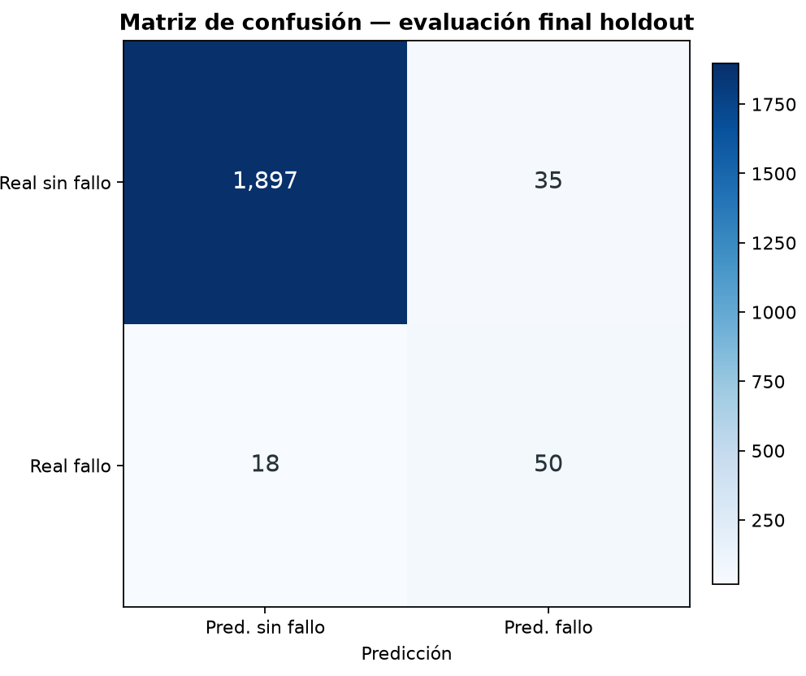

# Resultado M3 — selección y evaluación final

> Run `b15bab7b54bc2e1f`. AI4I 2020 es sintético. Este resultado no valida uso industrial
> y los scores de `predict_proba` no se evaluaron como probabilidades calibradas.

## Selección exclusivamente sobre training

| Candidato | AP media CV | AP std (ddof=0) | ROC-AUC media CV |
|---|---:|---:|---:|
| Dummy prior | 0.033875 | 0.000250 | 0.500000 |
| Regresión logística | 0.441433 | 0.068508 | 0.899275 |
| Random forest | 0.643812 | 0.022473 | 0.969935 |

Modelo elegido: **`random_forest`**. El dummy obtuvo AP media
`0.033875` y el candidato elegido
`0.643812`.

El umbral `0.696579921618` se congeló con predicciones OOF de training antes de
abrir holdout. En OOF: precision `0.5879`, recall `0.7159` y F1
`0.6456`. Estas cifras fueron parte de la selección, no son el resultado final.

## Evaluación final única sobre holdout

- Average Precision: **0.649538**.
- ROC-AUC: 0.965458.
- Precision al umbral: 0.588235.
- Recall al umbral: 0.735294.
- F1 al umbral: 0.653595.
- Matriz `[[TN, FP], [FN, TP]]`: `[[1897, 35], [18, 50]]`.
- Accuracy: 0.973500, mostrada con prevalencia positiva
  3.4000% y referencia de clase mayoritaria
  0.966000.

## Límites

- El holdout se consultó una sola vez después de congelar modelo y umbral; ejecuciones posteriores
  reutilizan el recibo versionado.
- El split aleatorio estima generalización IID dentro del generador sintético, no generalización
  temporal, entre máquinas o en industria.
- `class_weight` mejora el tratamiento de la minoría, pero los scores no están calibrados y no
  deben interpretarse como frecuencias industriales de fallo.
- No se probaron más algoritmos, hiperparámetros ni features después de observar el resultado.
