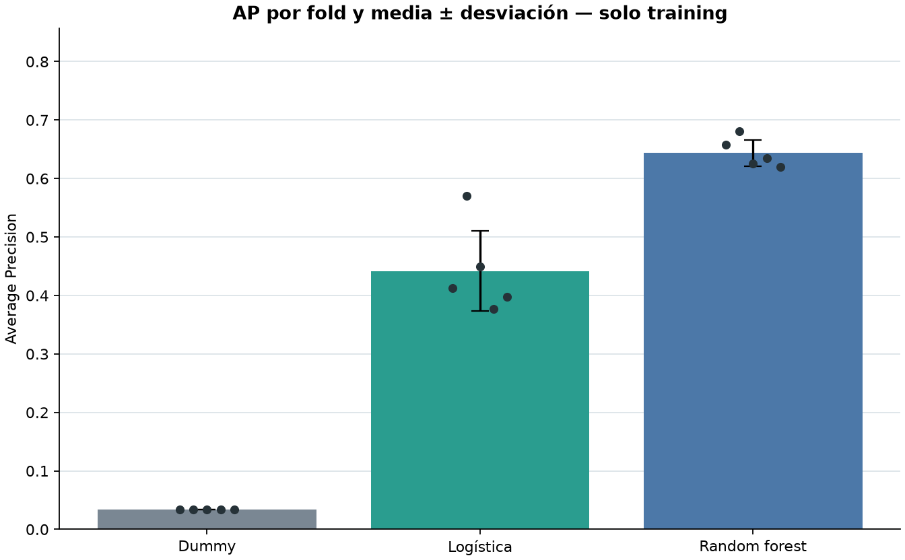
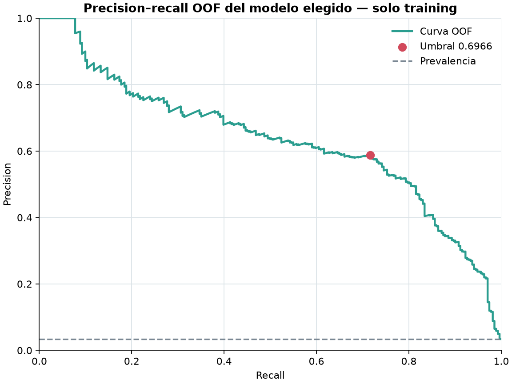

# Selección M3 sobre training

> Run `b15bab7b54bc2e1f`. AI4I 2020 es sintético; los scores no están calibrados ni validan uso industrial.

| Candidato | AP media | AP std (ddof=0) | ROC-AUC media |
|---|---:|---:|---:|
| Dummy prior | 0.033875 | 0.000250 | 0.500000 |
| Regresión logística | 0.441433 | 0.068508 | 0.899275 |
| Random forest | 0.643812 | 0.022473 | 0.969935 |

Se eligió `random_forest` exclusivamente por AP media de CV.
El umbral OOF congelado es
`0.696579921618` con la regla `score >= threshold`: precision
0.5879, recall 0.7159 y F1 0.6456. Estas son
estimaciones de selección sobre training, no resultados finales.

